# 📄 AI Resume Analyzer

<div align="center">
  <a href="https://codehype.ai/product/ai-resume-analyzer?utm_source=codehype_badge" target="_blank" rel="noopener noreferrer">
    
  </a>
</div>

An AI-powered Resume Analyzer built with **Streamlit** and **OpenAI GPT-4o-mini** that helps job seekers improve their resumes, generate personalized cover letters, and prepare for interviews.

---

## 🚀 Features

✅ Resume Analysis

- Resume Quality Score
- ATS Compatibility Score
- Resume Statistics
- Strengths & Weaknesses
- Missing Skills Detection
- Resume vs Job Description Match
- Project Feedback
- Action Plan

---

✅ Cover Letter Generator

- Professional Cover Letter
- Personalized Content
- Job Role Based
- Download as Markdown

---

✅ Interview Question Generator

- Technical Questions
- Project-Based Questions
- HR Questions
- Interview Preparation Tips

---

## 🛠 Tech Stack

- Python
- Streamlit
- OpenAI API
- GPT-4o-mini
- PyPDF
- python-dotenv

---

## 📂 Project Structure

```text
AI-Resume-Analyzer/
│
├── assets/
│   ├── home_page.png
│   ├── developer_mode.png
│   ├── resume_analysis_1.png
│   ├── resume_analysis_2.png
│   ├── resume_analysis_3.png
│   ├── resume_analysis_4.png
│   ├── resume_analysis_5.png
│   ├── cover_letter.png
│   ├── interview_questions_1.png
│   ├── interview_questions_2.png
│   └── interview_questions_3.png
│
├── utils/
│   ├── __init__.py
│   ├── analyzer.py
│   ├── demo_data.py
│   ├── error_handler.py
│   ├── file_handler.py
│   ├── prompts.py
│   ├── score_utils.py
│   └── validators.py
│
├── app.py
├── config.py
├── requirements.txt
├── .env
├── .gitignore
└── README.md
```

---

# 📸 Application Preview

## Home Page

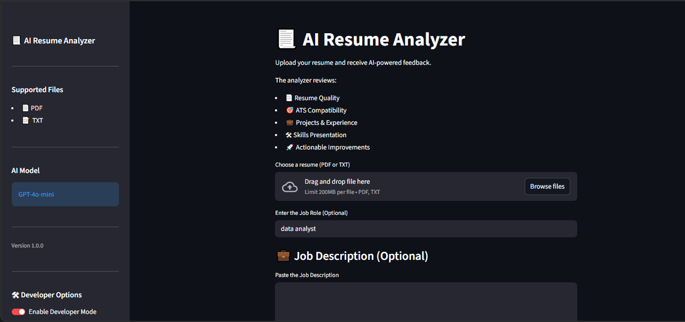

---

## Developer Mode

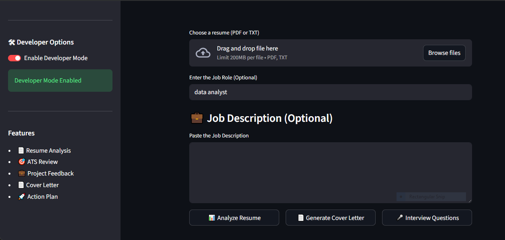

---

## Resume Analysis

### Resume Score & Statistics

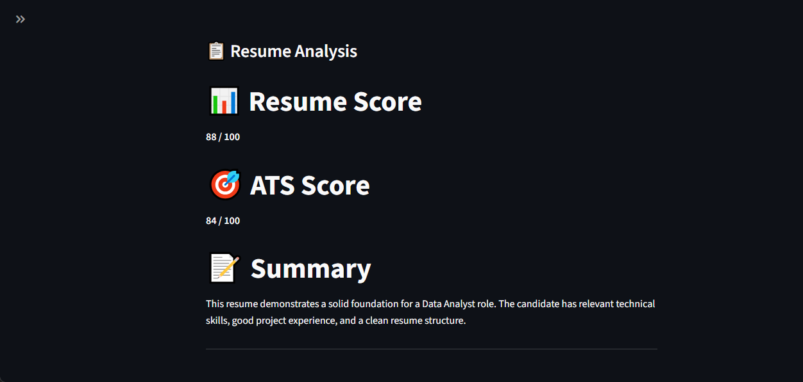

---

### Resume Summary

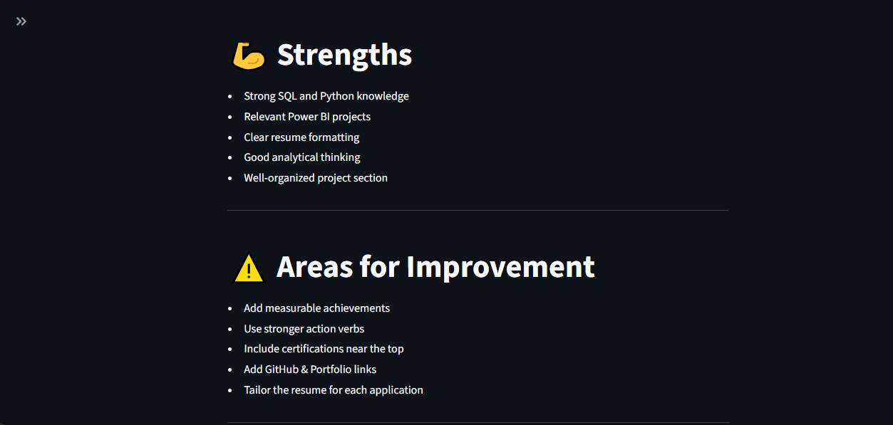

---

### Strengths & Improvements

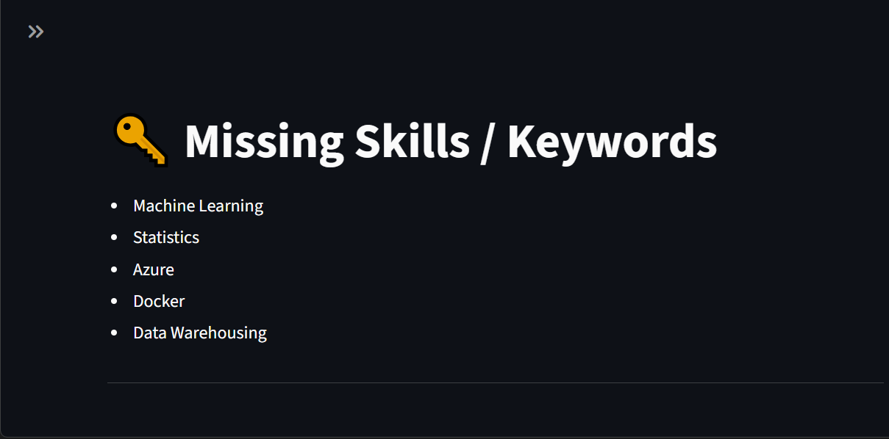

---

### Resume vs Job Description

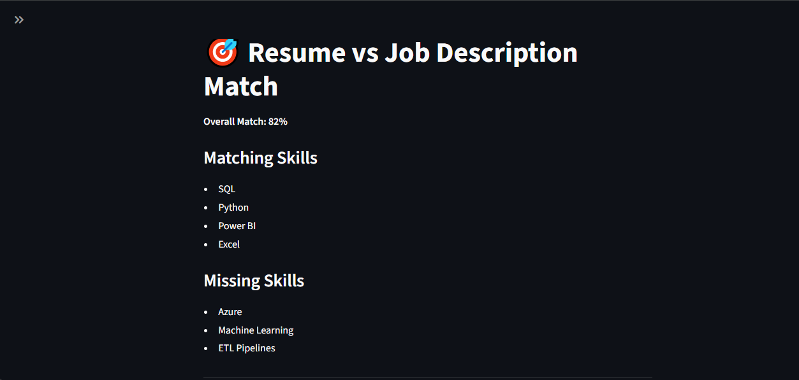

---

### Project Feedback & Action Plan

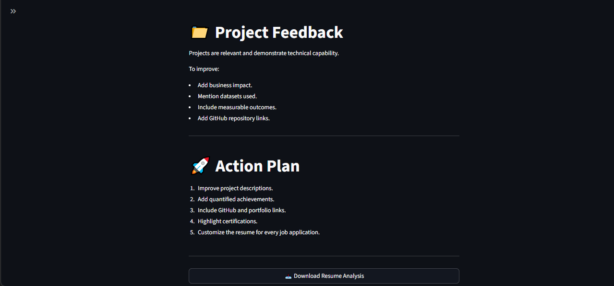

---

## Cover Letter Generator

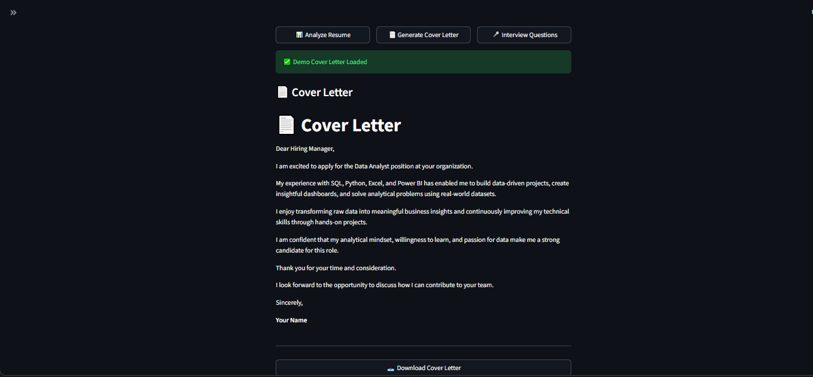

---

## Interview Question Generator

### Technical Questions

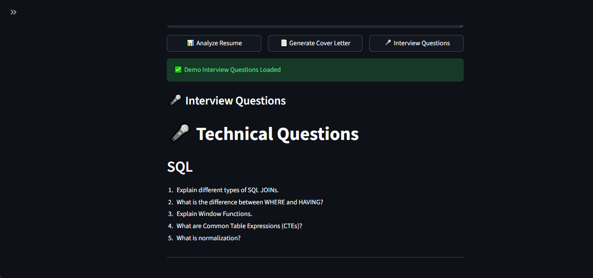

---

### Project Questions

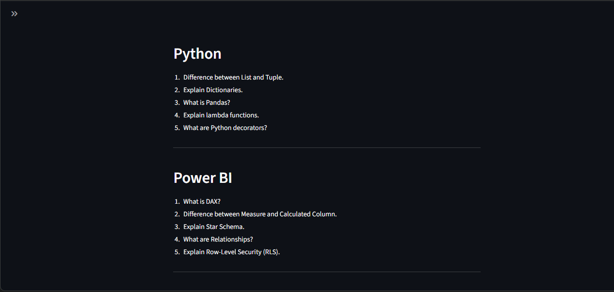

---

### HR Questions & Tips

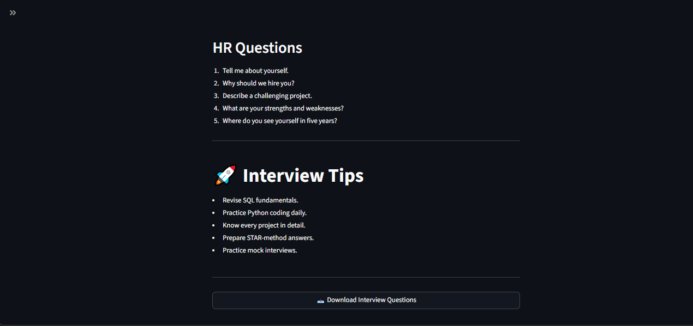

---

# ⚙️ Installation

Clone the repository

```bash
git clone https://github.com/Vipin-Andel/AI-Resume-Analyzer.git
```

Move into the project

```bash
cd AI-Resume-Analyzer
```

Install dependencies

```bash
pip install -r requirements.txt
```

Create a **.env** file

```env
OPENAI_API_KEY=your_api_key_here
```

## ▶️ Run Locally

Clone the repository

```bash
git clone https://github.com/Vipin-Andel/AI-Resume-Analyzer.git
```

Go to the project directory

```bash
cd AI-Resume-Analyzer
```

Install dependencies

```bash
pip install -r requirements.txt
```

Create a `.env` file and add your OpenAI API key

```text
OPENAI_API_KEY=your_api_key_here
```

Run the application

```bash
streamlit run app.py
```

## 🌐 Live Demo

Try the application online:

**https://ai-resume-analyzer-e9h9hpbgzcccq7aqpn7slc.streamlit.app/**

---

# 📦 Requirements

```
streamlit
openai
python-dotenv
pypdf
```

Install using

```bash
pip install -r requirements.txt
```

---

# 🧪 Developer Mode

The application includes a built-in Developer Mode.

When enabled:

- No OpenAI API required
- Demo Resume Analysis
- Demo Cover Letter
- Demo Interview Questions

Useful for testing UI without API usage.

---

# 📄 Supported Files

- PDF
- TXT

Maximum File Size:

**5 MB**

---

# 🎯 Future Improvements

- DOCX Support
- Resume PDF Export
- ATS Keyword Highlighting
- JSON Output
- Multiple Resume Templates
- AI Resume Rewrite
- Multi-language Support
- Dark/Light Theme

---

## 👨‍💻 Author

**Vipin Andel**

🔗 GitHub: [Vipin-Andel](https://github.com/Vipin-Andel)

If you found this project useful, consider giving it a ⭐.

---

# ⭐ If you like this project

Give this repository a ⭐ on GitHub.

It motivates me to build more AI-powered Data Science projects.
